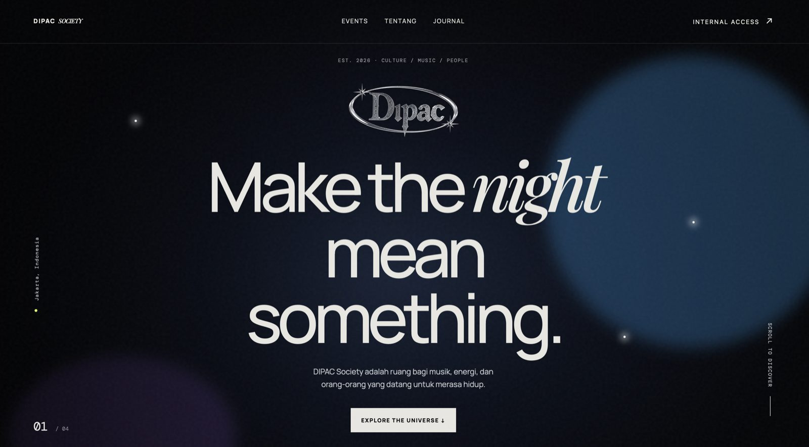
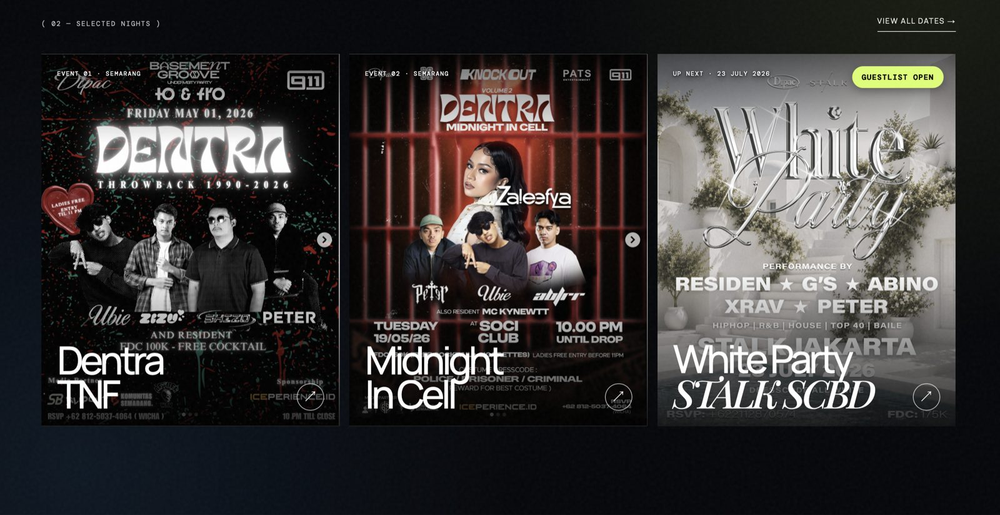
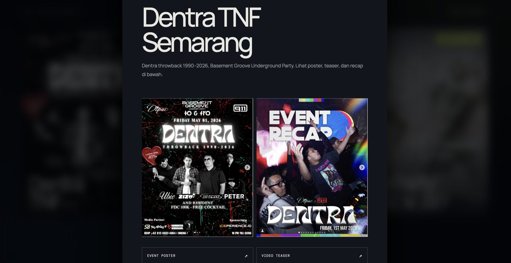
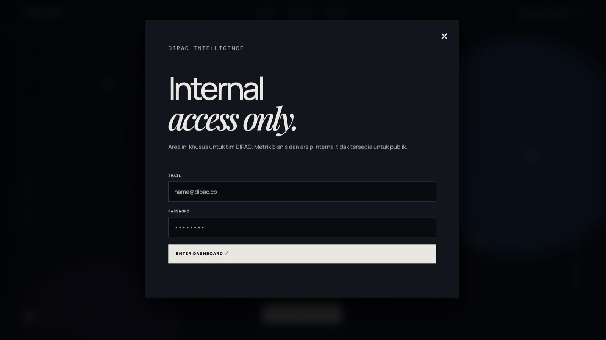

# DIPAC Society

Landing page publik + DIPAC Intelligence Dashboard privat untuk event promotion business, dengan fitur import & analisis PDF report otomatis. Dibangun full-stack dengan Python standard library saja (tanpa framework) di sisi server, dan vanilla HTML/CSS/JS di sisi client.

## Screenshot

| | |
|---|---|
|  |  |
|  |  |
|  |  |

## Stack

- **Backend**: Python `http.server` (ThreadingHTTPServer) + SQLite, tanpa framework
- **Frontend**: Vanilla HTML/CSS/JS, tanpa build step
- **AI/Parsing**: Ekstraksi & analisis PDF report offline (regex-based, tanpa API key eksternal)
- **Auth**: Salted PBKDF2 password hashing, session expiry, login rate-limiting
- **Deploy**: systemd + Caddy reverse proxy di VPS Ubuntu

## Struktur

```
backend/app.py      - server (stdlib http.server + SQLite)
frontend/            - HTML/CSS/JS (landing page + dashboard)
ai/                   - ekstraksi teks PDF & analisis metrik event
data/                 - dipac.db (dibuat otomatis saat pertama jalan, tidak di-commit)
assets/               - gambar & video
reports/, uploads/    - hasil parsing & file PDF yang diunggah (tidak di-commit)
deploy/               - systemd service, Caddyfile, dan runbook deploy
```

## Jalankan

```bash
cd dipac-society
python3 -m pip install -r requirements.txt   # opsional, untuk baca PDF report
python3 backend/app.py
```

Buka `http://localhost:8000`.

## Akun awal

Saat server pertama kali dijalankan dan belum ada user di database, akun admin dibuat otomatis:

- Email: `admin@dipac.co`
- Password: diambil dari environment variable `DIPAC_ADMIN_PASSWORD` kalau di-set; kalau tidak, sistem generate password acak dan menampilkannya sekali di log server saat startup.

```bash
DIPAC_ADMIN_PASSWORD="password-kamu-sendiri" python3 backend/app.py
```

Password bisa diganti kapan saja lewat halaman **Account** di dashboard. Halaman publik sengaja tidak memaparkan revenue, transaksi, pax, atau analitik internal — semua itu ada di balik login.

## Fitur dashboard (`DIPAC Intelligence Portal`)

Semua di bawah ini ada di balik login — halaman publik tidak pernah memaparkan angka bisnis apapun.

- **Overview** — 5 kartu metrik ringkasan (Total Revenue, Net Profit, Total Collective Share, Total Pax, Transactions), digabung dari semua event yang sudah diupload.
- **Import PDF report** — upload laporan keuangan event (PDF), sistem otomatis ekstrak teksnya dan baca metriknya (regex offline, tanpa API key eksternal).
- **Event Analysis** — breakdown per event: customer spending, collective income, bottle sold, average spending, profit contribution, commission rate, tabel transaksi, dan bar chart.
- **Event Comparison** — bandingkan performa semua event sekaligus (total spending, income, rata-rata komisi, event terbaik).
- **Executive Report** — ringkasan strategis per event plus rekomendasi otomatis dalam Bahasa Indonesia (mis. saran kapasitas VIP, benchmark menu terlaris).
- **Event Performance** — tabel riwayat semua event dengan tombol export summary.
- **AI Insights** — insight naratif yang di-generate dari data event yang sudah diupload.
- **Account** — ganti password admin sendiri, kapan saja.

Kalau `PyMuPDF`/`pdfplumber` tidak terpasang, sistem otomatis coba `pdftotext` (poppler) sebagai fallback; kalau tetap tidak ada, ekstraksi teks akan kosong dan analisis akan meminta report yang lebih lengkap.
